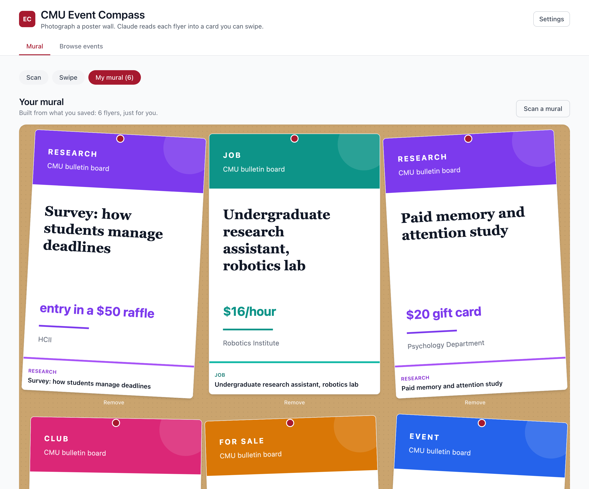

# CMU Event Compass

Photograph one of those crowded poster walls at CMU. Claude reads every flyer on it (events, research studies, jobs, tutoring, things for sale, club sign-ups), and you swipe through them to build your own mural: a board of just the posters that matter to you.

Those opportunities live on physical boards and in scattered newsletters, Slack, and Discord, so students miss most of them. Event Compass turns a single photo into a personalized, swipeable board.

Built with Claude at the CMU Claude Hackathon in November 2025, and extended with Claude since.

**Live demo:** https://pazare.github.io/Claude-CMU-Hackathon/
**Pitch deck:** https://pazare.github.io/Claude-CMU-Hackathon/pitch.html



The live demo is the real Next.js app, exported as a static site and deployed to GitHub Pages. A built-in sample board lets you try the whole flow with no API key. The original static design mock is kept at https://pazare.github.io/Claude-CMU-Hackathon/mock.html.

## How it works

1. **Scan.** Upload or photograph a poster wall, and tag it with a location and date.
2. **Extract.** Claude vision reads the photo and returns one structured listing per flyer: a title, a category, a short summary, and whatever the flyer prints (time, place, contact, price, compensation, tags). It also returns each flyer's bounding box, so the app crops the real poster out of a high-resolution copy of your photo and keeps it sharp.
3. **Rank.** A local heuristic orders the postings by your chosen interests. This runs entirely in your browser: no API call, no cost, and deterministic.
4. **Swipe.** Go through the deck and swipe right to keep a flyer, left to skip it. Drag, buttons, and the arrow keys all work.
5. **Your mural.** The flyers you keep become a personalized board of the real posters, pinned and laid out like a corkboard.

A secondary **Browse** tab keeps the earlier idea: a filterable, cross-CMU events feed (sample data for now).

## How the app uses Claude

The extraction calls the Claude [Messages API](https://docs.claude.com/en/api/messages) directly from the browser. It sends the photo as an image and uses [structured outputs](https://docs.claude.com/en/docs/build-with-claude/structured-outputs) (a JSON schema) so each flyer comes back as a typed object, including the bounding box used for cropping. The default model is Claude Opus 4.8 (`claude-opus-4-8`), with Sonnet 4.6 and Haiku 4.5 as cheaper options in Settings.

Because the app is a static site with no backend, it uses your own Anthropic API key. The key is stored only in your browser, sent only to the Anthropic API, and never committed. Get one at [console.anthropic.com](https://console.anthropic.com) and paste it into Settings. The sample board runs without a key.

### Optional: recreate a poster with OpenAI

If a crop comes out blurry or skewed, add an OpenAI key in Settings and tap **Recreate** on that poster in your mural. The app sends the crop to OpenAI's image model (`gpt-image-1`) with a prompt to reproduce the flyer faithfully, and swaps in the clean redraw. It runs one poster at a time and is entirely optional; the real crop is the default. The recreate is a faithful redraw, not a pixel copy, and the OpenAI key (like the Anthropic one) stays in your browser.

## Run it

```bash
npm install && npm run dev
```

Then open http://localhost:3000. Try the sample board, or add your API key in Settings to scan a real photo.

Other commands:

```bash
npm run typecheck     # tsc --noEmit
npm run lint          # next lint
npm run format        # prettier --write
npm run format:check  # prettier --check
npm test              # vitest
npm run build         # production build (static export to out/)
```

## How it is built

Next.js 14 (App Router), React 18, and TypeScript in strict mode, styled with Tailwind CSS. The app is a static export with no server: the Claude call runs client side against your key, and the ranker, image cropping, and persistence all run in the browser. Tests run on Vitest, with ESLint and Prettier. GitHub Actions runs typecheck, lint, format check, tests, and build on every push and pull request; a separate workflow deploys the static export to GitHub Pages.

Repo layout:

| Path                                          | What it is                                                      |
| --------------------------------------------- | --------------------------------------------------------------- |
| `lib/extract.ts`                              | Calls Claude vision and parses each flyer, with bounding boxes. |
| `lib/ranker.ts`                               | The local, deterministic ranker that orders the swipe deck.     |
| `lib/image.ts`, `lib/poster-svg.ts`           | Photo prep and cropping; generated SVG posters for the sample.  |
| `components/mural/`                           | Scan, swipe deck, the mural board, poster tiles, and settings.  |
| `components/BrowseView.tsx`, `data/events.ts` | The secondary events feed.                                      |
| `public/mock.html`, `public/pitch.html`       | The original design mock and the pitch deck.                    |
| `*.test.ts(x)`                                | Vitest unit and component tests.                                |

## How Claude was used

Claude (via Claude Code) wrote and iterated the app: the hackathon prototype and the mural extension built since. Human direction covered the product idea, the scan-to-swipe flow, the data model, and CMU-specific details. At runtime, the app uses Claude vision to read the boards.

## What this is

A hackathon project extended into a working prototype, not a production system.

- Extraction quality depends on the photo and the model, and crops depend on the bounding boxes the model returns. When a flyer is not located, its typeset card shows instead of a crop.
- Postings and saved flyers persist in localStorage only. There are no accounts and no backend. Large image crops can exceed the browser storage quota, in which case the text is kept and the crop is dropped.
- The sample board uses generated SVG posters, not photos of real flyers.
- The Browse tab uses mock event data in `data/events.ts`; there is no live CMU feed yet.

## Roadmap

1. Let a board be owned and curated by a CMU org, with sign-in (for example by andrew.cmu.edu address) so a board can be shared across students.
2. Deskew and clean up crops, and improve flyer detection on dense boards.
3. Add accounts and a backend so murals sync across devices and the API key can move server side.
4. Connect the Browse feed to real CMU calendars.

## License

MIT. See LICENSE.
